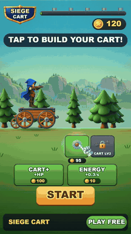
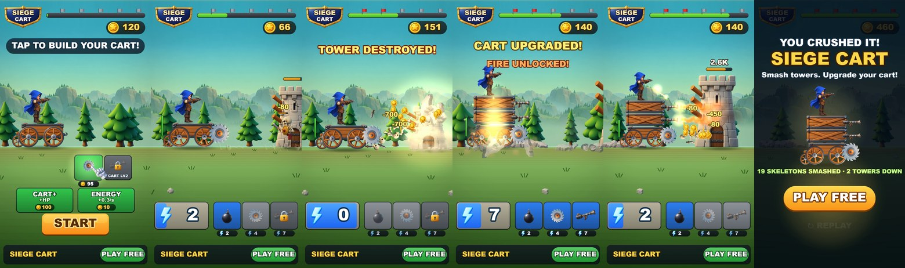

# Siege Cart — playable ad, собранный ИИ-пайплайном

**▶ Играть в браузере / с телефона:** https://bankaino.github.io/siege-cart-playable/
(A/B-варианты: [combat_first](https://bankaino.github.io/siege-cart-playable/combat_first.html) · [fast_energy](https://bankaino.github.io/siege-cart-playable/fast_energy.html) · [rich_start](https://bankaino.github.io/siege-cart-playable/rich_start.html) · [cta_copy](https://bankaino.github.io/siege-cart-playable/cta_copy.html))

<p align="center"></p>

Портретная playable-реклама гибрид-казуальной игры про боевую тележку с лучником. Сделана **по мотивам рекламного креатива** (тележка едет вправо, скелеты и каменные башни, карточки способностей за энергию, апгрейд тележки) — со своим брендом, механикой, экономикой и артом. Весь путь от референса до билдов под рекламные сети пройден с ИИ-инструментами: **Claude Code** (код, архитектура, агенты-критики), **Codex / ChatGPT image gen** (весь арт), собственные тулзы для сборки и проверки.



## Что внутри за 17 секунд

| время | бит | что видит игрок |
|---|---|---|
| 0–3 с | хук | рука показывает на карточку пилы: «TAP TO BUILD YOUR CART!», затем START (без касаний игра стартует сама через 3.2 с) |
| 3–8 с | ядро | выезжают скелеты, лучник стреляет сам, копится энергия → первая бомба, монеты летят в счётчик (первый килл на 4.0 с) |
| ~9.5 с | вау-момент 1 | бросок пилы по земле валит башню: обломки, пыль, дождь монет, флажок на полосе прогресса краснеет |
| ~11 с | вау-момент 2 | над тележкой «⬆250» → она вырастает на два яруса, ставятся огнемёты, открывается FIRE (и сразу оплачен энергией) |
| 13–17 с | развязка | огненный конус плавит волну, вторая башня падает → победа |
| 17 с+ | эндкард | тележка, статистика, PLAY FREE (весь экран — CTA), REPLAY |

Принципы из практики плейаблов: хук ≤ 3 с одним пальцем; первая награда ≤ 8 с; **кнопка стора видна всё время**; на каждое действие — отклик (тряска, частицы, звук, след в мире), даже на «нельзя» («NEED 95 COINS», «NOT ENOUGH ENERGY»); тапы по пустому месту не считаются вводом и не продлевают игру; рука возвращается к полезной карточке; эндкард гарантирован всем (жёсткий потолок 26 с).

**Игра не проходится сама.** Тележка едет и стреляет, но без нажатий на BOMB / SAW-THROW / ⬆ / FIRE волны скелетов её разбирают — и проигрыш тоже ведёт на кнопку стора («SO CLOSE!»). Баланс проверяется скриптом `node tools/policies.js`, который играет разными «зрителями»:

| зритель | результат |
|---|---|
| ни одного касания | поражение на ~10.8 с |
| только SAW + START, дальше ничего | поражение на ~8.8 с |
| быстрый / средний игрок (реакция 0.7–1.5 с) | победа, HP почти не страдает |
| реакция 2.5 с | победа с запасом ~263 из 300 HP |
| реакция 4 с | поражение (уже на второй башне) |
| демо-прогон (аттракт-режим) | победа на 16.9 с |

## Билды под рекламные сети — одной командой

```bash
python tools/build_playable.py --variant all
```

Каждый билд — **один HTML-файл** без внешних запросов: движок, код, текстуры (WebP в base64) и адаптер сети.

| сеть | размер | лимит | CTA / жизненный цикл |
|---|---|---|---|
| AppLovin | 0.50 MB | 5 MB | MRAID `mraid.open` |
| Unity Ads | 0.50 MB | 5 MB | MRAID |
| ironSource | 0.50 MB | 5 MB | DAPI `openStoreUrl` |
| Mintegral | 0.50 MB | 5 MB | `install()`, `gameReady()`, `gameEnd()` |
| Google Ads | 0.32 MB (zip) | 5 MB | `ExitApi.exit()` |
| Meta | 0.50 MB | 2 MB | `FbPlayableAd.onCTAClick()` |

Звук выключается, когда реклама не видна (MRAID `viewableChange` / DAPI `audioVolumeChange`). Полный отчёт: [docs/build-report.md](docs/build-report.md).

## Размер и производительность

| что | было | стало | как |
|---|---|---|---|
| вес билда | 46 MB (первый Unity WebGL прототип) | **0.50 MB** | свой 2D WebGL2-движок без зависимостей, всё inline |
| текстуры | 15.8 MB PNG (25 спрайтов из ИИ) | **283 KB** | WebP ровно под размер на экране × 1.4 (`tools/build.json`) |
| код | — | **104 KB** | симуляция, сцена, звук, адаптеры сетей |
| звук | — | **0 байт** | процедурный WebAudio (`live/audio.js`) |
| FPS на мобильном вьюпорте 390×844 | — | **60–61** | headless smoke-тест, GPU-рендер |
| анимация | — | **0 байт** | риги в коде: колёса катятся по пройденному пути, пила крутится быстрее в контакте, ноги скелета качаются вокруг бедра, ящики вырастают с отскоком, башня проседает при падении |

Экран заполняется на любом телефоне: ширина вида 1080, высота следует соотношению сторон устройства (16:9 … 19.5:9).

## A/B-гипотезы

Вариант = JSON с гипотезой и **одной** переменной (`variants/*.json`), билдится той же командой. Ожидаемая метрика записана в самом файле:

- `default` — контроль.
- `combat_first` — пропускаем магазин: пила уже куплена, тележка уже едет, первый килл на 2.4 с вместо 4.0 с. *Лучше ли открываться боем, как референс, чем «собери тележку»?* → 3-секундный tap-rate, completion.
- `fast_energy` — энергия 1.8/с вместо 1.0/с: карточка готова почти каждую секунду, вау-моменты ~на 2.5 с раньше. *Агентность против спокойного темпа.* → тапы за сессию, completion.
- `rich_start` — 215 стартовых монет вместо 120: до START хватает и на пилу, и на CART+. *Влияет ли выбор в магазине на первый тап?* → 3-секундный tap-rate, CTR.
- `cta_copy` — только текст кнопки и эндкарда («INSTALL», «CRUSH THEM ALL!»). *Изолированный эффект копирайта CTA.* → CTR.

## Как проверяется качество

- **Smoke-тест** (`tools/smoke_test.mjs`): открывает собранный HTML в мобильном вьюпорте с заглушкой MRAID, жмёт SAW → START → BOMB → SAW-THROW → CTA, проверяет — нет ошибок, нет внешних запросов, монеты и способности работают, CTA вызывает `mraid.open`, FPS ≥ 50.
- **Детерминированная симуляция** (`live/sim.js`): демо-прогон проверяется headless (`SIM.demoCheck`) — все биты рекламы наступают в нужное время; экономика тюнится числами (`tools/timeline.js`, `tools/policies.js`), а не на глаз.
- **QA HUD**: 11 экранов HUD рендерятся с худшими строками, проверяются выход текста за панель и наложения.
- **Независимые агенты-критики** (Sonnet): три прохода — после сцены, после арта (Gate A) и перед публикацией (Gate B). Они замеряют тайминги, сравнивают с референсом и играют билд разными «зрителями»; их отчёты и что было исправлено: [study/critique/](study/critique/), журнал решений — [study/PLAN.md](study/PLAN.md).
- **Плейтест человеком**: правки после ручной игры в браузере (игра больше не проходится сама, стрелка апгрейда, влезание логотипа в щит) тоже записаны в журнале.

## ИИ-пайплайн

1. **Разбор референса** → решения: гибрид «магазин → автобой с карточками», своя айдентика, 2.5D в HTML5.
2. **Арт**: style bible, снятая с референса (палитра, ракурс, свет), и промпт на каждый ассет (`art/prompts/`, генерируются `tools/write_prompts.py`); 19 картинок через Codex пачками, нарезка листов (сосны, обломки, камни), авто-подготовка текстур. Все основные ассеты вышли с первого раза, потому что промпты жёстко задают ориентацию: «вид сбоку, смотрит вправо, плоское дно, колёса отдельно». Исходники: `art/gen/`.
3. **Код**: симуляция, сцена, HUD, звук — Claude Code; живое превью с hot-reload.
4. **Проверка**: smoke-тест, QA, агенты-критики → правки → варианты → билды → плейтест.

Пайплайн упакован в переиспользуемый скилл для Claude Code (`ref2playable`): новый плейабл по референсу стартует с готового шаблона, новыми остаются только механика и арт.

## Ограничения и следующие шаги

- Это 2.5D: нарисованные ИИ спрайты с запечённым объёмом, а не настоящее 3D, как в референсе. Порт на Unity / Luna Playworks — отдельный шаг (симуляция детерминированная и не привязана к движку).
- ~150–300 draw calls на кадр в самые насыщенные моменты: фигуры HUD не батчатся. Первая оптимизация для слабых Android; на реальном устройстве билд пока не гонялся.
- Нет адаптеров Pangle / TikTok / Liftoff; нет паузы звука по `document.hidden` (MRAID-видимость обработана).
- Ссылки на стор в демо ведут на этот репозиторий — для реального теста сети подставьте `market://` / App Store.

## Запуск локально

```bash
python -m http.server 8000      # из корня репозитория
# http://localhost:8000/live/index.html?ad=1  — живая версия (рекламный режим)
# http://localhost:8000/live/index.html       — авто-демо (attract), любое касание — играть
python tools/build_playable.py --variant all --pages docs   # билды + демо для GitHub Pages
node tools/smoke_test.mjs dist/default/applovin.html        # нужен Playwright
node tools/policies.js                                       # что видят разные «зрители»
```

## Структура

```
live/        движок (gl.js, lib.js, batch.js), игра (sim.js, scene.js), звук, index.html
tools/       build_playable.py, build.json (текстуры, стор), smoke_test.mjs, timeline.js, policies.js, perf_probe.mjs, write_prompts.py
variants/    A/B-гипотезы
art/         style bible, промпты, сгенерированные исходники
study/       журнал решений (PLAN.md) и отчёты агентов-критиков
docs/        демо для GitHub Pages, медиа, отчёт по билдам
```

*Референс — чужой рекламный креатив, в репозиторий не включён. Название, бренд и весь арт — свои; ссылки на стор — заглушки.*
